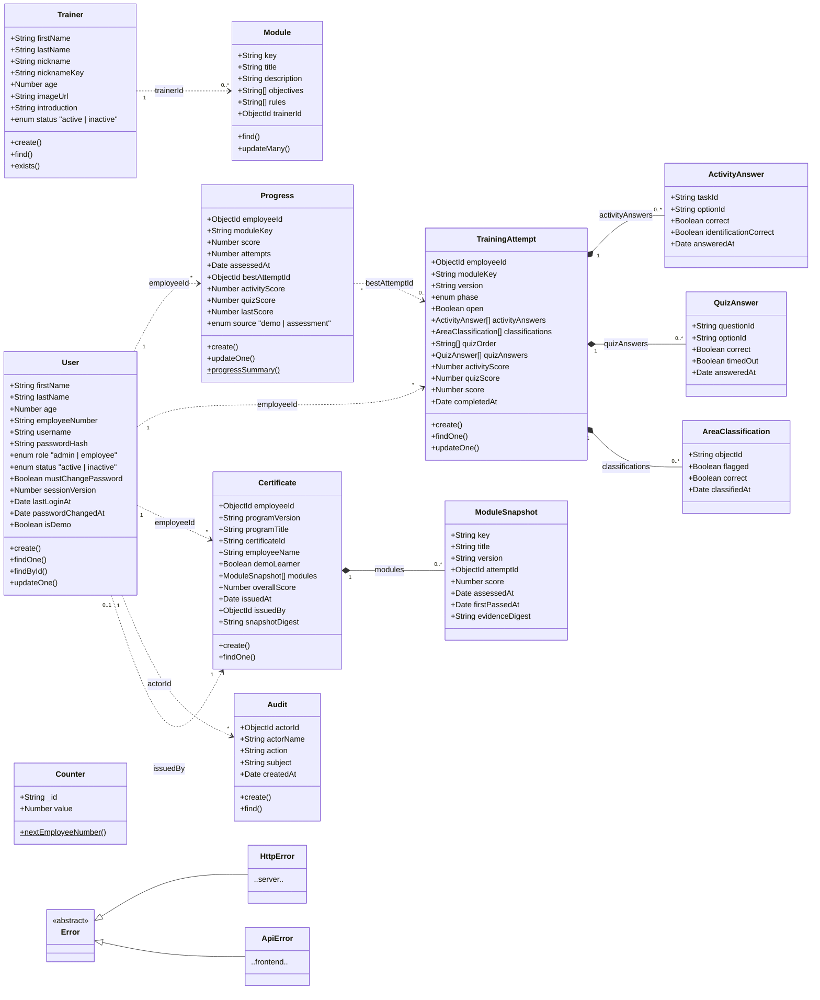

# Zero Incident — Class Diagram

> How to view this file:
> - **On GitHub**: push it to your repo — GitHub renders Mermaid diagrams natively in `.md` files (open it on the repo's *Code* page).
> - **Anywhere**: paste the code block below into <https://mermaid.live> and export as PNG/SVG.

